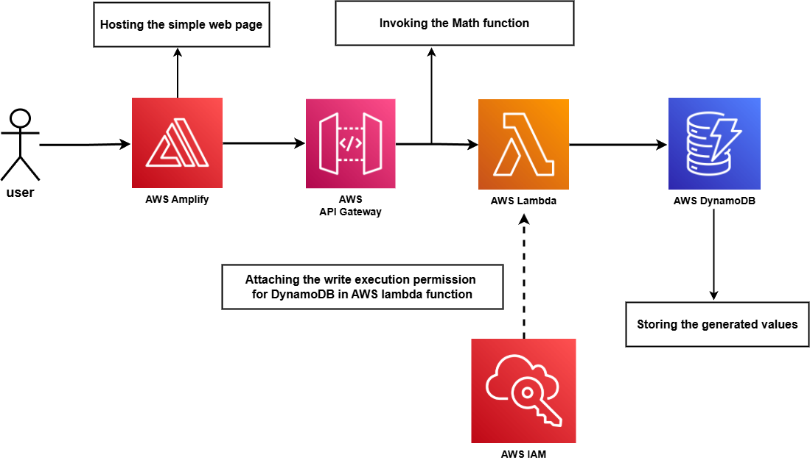

# Power of Math function using AWS

Lambda function configured with AWS Amplify, AWS API Gateway, DynamoDB and IAM for when a user invoking the math function to generate the answer for given base and exponents.

🔧 AWS Architecture & Services Used

1. AWS Amplify → Hosted a React-based UI where users input numbers.

2. AWS Lambda  → Executed the core logic in Python to calculate power of a number given by base and exponent.

3. API Gateway → Connected the frontend to Lambda, use to invoke Lambda function.

4. DynamoDB → Stores every calculation with a unique ID.

5. AWS IAM → Granting execution permission to write into DynamoDB attached with AWS Lambda function.

# Architecture

